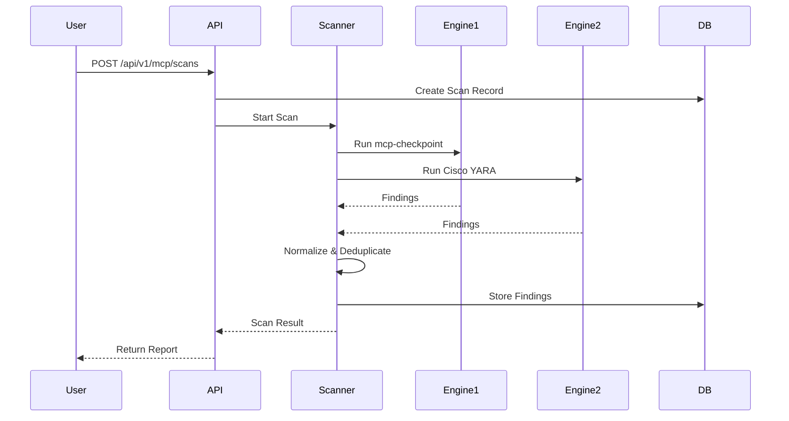

# Documentation Improvement Plan

This document outlines specific recommendations to enhance the SentraScan Platform documentation.

## Current State Assessment

### ✅ Strengths
- Comprehensive technical documentation exists
- API documentation with examples
- Database schema documented
- Deployment guide included
- Troubleshooting section present

### 🔄 Areas for Improvement
- User-focused guides (getting started, tutorials)
- Visual diagrams and workflows
- More real-world examples
- Operational runbooks
- Integration guides
- Performance optimization

---

## Recommended Improvements

### 1. User Guides & Tutorials

**Priority: High** | **Effort: Medium**

Create step-by-step guides for different user personas:

#### 1.1 Quick Start Guide (`docs/QUICK-START.md`)
- **Target:** New users
- **Content:**
  - Installation in 5 minutes
  - First scan (MCP and Model)
  - Understanding results
  - Next steps
- **Format:** Step-by-step with screenshots/terminal output

#### 1.2 User Guide (`docs/USER-GUIDE.md`)
- **Target:** End users (developers, DevOps)
- **Content:**
  - Common workflows
  - How to interpret findings
  - Remediation strategies
  - Best practices
- **Sections:**
  - Scanning MCP configurations
  - Scanning ML models
  - Managing baselines
  - Policy configuration
  - CI/CD integration

#### 1.3 Administrator Guide (`docs/ADMIN-GUIDE.md`)
- **Target:** System administrators
- **Content:**
  - Production deployment
  - Security hardening
  - Backup and recovery
  - Monitoring and alerting
  - Performance tuning
  - Multi-tenant setup (future)

---

### 2. Visual Documentation

**Priority: High** | **Effort: Medium**

#### 2.1 Architecture Diagrams
- **Current:** Text-based ASCII diagram
- **Improvement:** 
  - Mermaid diagrams (renderable in GitHub)
  - System architecture (high-level)
  - Data flow diagrams
  - Sequence diagrams for scan workflows
  - Component interaction diagrams

**Example:**


#### 2.2 Workflow Diagrams
- Scan execution flow
- Baseline creation workflow
- Policy evaluation flow
- Authentication flow

---

### 3. Enhanced Examples

**Priority: Medium** | **Effort: Low**

#### 3.1 Real-World Scenarios
Add to `TECHNICAL-DOCUMENTATION.md`:

- **Scenario 1:** CI/CD Pipeline Integration
  - Complete GitHub Actions workflow
  - GitLab CI example
  - Jenkins pipeline
  - Azure DevOps pipeline

- **Scenario 2:** Baseline Management Workflow
  - Creating initial baseline
  - Detecting drift
  - Approving changes
  - Rollback procedure

- **Scenario 3:** Multi-Environment Setup
  - Development environment
  - Staging environment
  - Production environment
  - Policy differences per environment

#### 3.2 API Client Examples
Add code examples in multiple languages:

- **Python Client:**
```python
from sentrascan_client import SentraScanClient

client = SentraScanClient(
    base_url="http://localhost:8200",
    api_key="your-api-key"
)

# Scan MCP config
result = client.scan_mcp(
    auto_discover=True,
    policy_path=".sentrascan.yaml"
)

if result.gate_result.passed:
    print("✅ Scan passed")
else:
    print(f"❌ Scan failed: {result.gate_result.blocking_findings} findings")
```

- **cURL Examples:**
  - Complete request/response examples
  - Error handling examples
  - Authentication examples

- **JavaScript/TypeScript Client:**
  - Node.js examples
  - Browser examples

---

### 4. Operational Documentation

**Priority: High** | **Effort: Medium**

#### 4.1 Runbooks (`docs/RUNBOOKS.md`)
- **Daily Operations:**
  - Health check procedures
  - Monitoring dashboards
  - Log analysis
  - Performance metrics

- **Incident Response:**
  - Service degradation
  - Database issues
  - Scanner failures
  - Authentication problems

- **Maintenance:**
  - Database backup procedures
  - Database restore procedures
  - Upgrade procedures
  - Rollback procedures
  - Cleanup procedures

#### 4.2 Monitoring Guide (`docs/MONITORING.md`)
- **Metrics to Monitor:**
  - Scan success rate
  - Scan duration (P50, P95, P99)
  - API response times
  - Database query performance
  - Resource usage (CPU, memory, disk)

- **Alerting:**
  - What to alert on
  - Alert thresholds
  - Alert channels

- **Dashboards:**
  - Prometheus metrics (if implemented)
  - Grafana dashboard examples
  - Custom metrics

#### 4.3 Backup & Recovery (`docs/BACKUP-RECOVERY.md`)
- **Backup Strategy:**
  - Database backup procedures
  - Configuration backup
  - Baseline backup
  - Automated backup scripts

- **Recovery Procedures:**
  - Point-in-time recovery
  - Full system recovery
  - Partial recovery (scans only, baselines only)

- **Disaster Recovery:**
  - RTO/RPO targets
  - Recovery procedures
  - Testing procedures

---

### 5. Integration Guides

**Priority: Medium** | **Effort: Low**

#### 5.1 CI/CD Integration Guide (`docs/INTEGRATION-CICD.md`)
Expand current examples with:

- **GitHub Actions:**
  - Complete workflow with error handling
  - Matrix builds
  - Artifact upload
  - PR comments with findings

- **GitLab CI:**
  - Complete `.gitlab-ci.yml` example
  - Merge request integration
  - Artifact reports

- **Jenkins:**
  - Pipeline script
  - Post-build actions
  - Notifications

- **Azure DevOps:**
  - YAML pipeline
  - Task integration
  - Artifact publishing

- **CircleCI:**
  - Configuration example
  - Workflow integration

#### 5.2 IDE Integration (`docs/INTEGRATION-IDE.md`)
- VS Code extension (if exists)
- Cursor integration
- CLI usage in development workflow

#### 5.3 Webhook Integration (`docs/INTEGRATION-WEBHOOKS.md`)
- Setting up webhooks
- Webhook payload format
- Example receivers (Slack, Teams, PagerDuty)

---

### 6. Performance & Optimization

**Priority: Medium** | **Effort: Low**

#### 6.1 Performance Tuning Guide (`docs/PERFORMANCE.md`)
- **Optimization Strategies:**
  - Database indexing
  - Query optimization
  - Caching strategies
  - Resource allocation

- **Scaling:**
  - Horizontal scaling (if supported)
  - Vertical scaling
  - Load balancing
  - Database scaling

- **Benchmarks:**
  - Performance test results
  - Resource usage patterns
  - Bottleneck identification

---

### 7. Security Documentation

**Priority: High** | **Effort: Low**

#### 7.1 Security Best Practices (`docs/SECURITY.md`)
Expand current security section:

- **Hardening Checklist:**
  - Production security checklist
  - Network security
  - Application security
  - Data security

- **Vulnerability Management:**
  - Dependency scanning
  - Security updates
  - CVE tracking

- **Compliance:**
  - SOC 2 considerations
  - ISO 27001 considerations
  - GDPR considerations

#### 7.2 Threat Model (`docs/THREAT-MODEL.md`)
- **Assets:**
  - Data assets
  - System components
  - Credentials

- **Threats:**
  - Threat identification
  - Risk assessment
  - Mitigation strategies

---

### 8. Developer Documentation

**Priority: Medium** | **Effort: Medium**

#### 8.1 Contributing Guide (`docs/CONTRIBUTING.md`)
Enhance existing `CONTRIBUTING.md`:

- **Development Setup:**
  - Detailed setup instructions
  - IDE configuration
  - Debugging setup

- **Code Standards:**
  - Coding style guide
  - Testing requirements
  - Documentation requirements

- **Pull Request Process:**
  - PR template
  - Review process
  - Merge criteria

#### 8.2 Architecture Decision Records (`docs/ADRs/`)
- **Format:** Markdown files following ADR format
- **Content:**
  - Why certain technology choices were made
  - Alternatives considered
  - Trade-offs

**Example ADRs:**
- `001-use-fastapi.md` - Why FastAPI was chosen
- `002-dual-engine-scanning.md` - Why dual-engine approach
- `003-sqlite-default.md` - Why SQLite is default

#### 8.3 Testing Guide (`docs/TESTING.md`)
- **Test Structure:**
  - Unit tests
  - Integration tests
  - End-to-end tests

- **Running Tests:**
  - Local testing
  - CI testing
  - Test coverage

- **Writing Tests:**
  - Test patterns
  - Mocking strategies
  - Fixtures

---

### 9. Reference Documentation

**Priority: Low** | **Effort: Low**

#### 9.1 Glossary (`docs/GLOSSARY.md`)
Define technical terms:
- MCP (Model Context Protocol)
- Baseline
- Drift
- Rug Pull
- SBOM (Software Bill of Materials)
- CycloneDX
- SAST/DAST
- YARA
- etc.

#### 9.2 FAQ (`docs/FAQ.md`)
Common questions:
- How do I scan a remote MCP server?
- Can I scan models from Hugging Face?
- How do I customize policies?
- What's the difference between severity levels?
- How do I handle false positives?
- Can I integrate with my existing security tools?

#### 9.3 Changelog (`docs/CHANGELOG.md`)
- Version history
- Breaking changes
- New features
- Bug fixes
- Deprecations

---

### 10. API Documentation Enhancements

**Priority: Medium** | **Effort: Low**

#### 10.1 OpenAPI Specification
- Generate OpenAPI 3.0 spec from FastAPI
- Host interactive API docs (Swagger UI)
- Export to Postman collection

#### 10.2 API Versioning
- Document versioning strategy
- Migration guides between versions
- Deprecation notices

#### 10.3 Rate Limiting
- Document rate limits (if implemented)
- Rate limit headers
- Handling rate limit errors

---

## Implementation Priority

### Phase 1: High Priority (Immediate)
1. ✅ Quick Start Guide
2. ✅ User Guide
3. ✅ Visual Diagrams (Mermaid)
4. ✅ Enhanced CI/CD Examples
5. ✅ Runbooks

### Phase 2: Medium Priority (Next Sprint)
1. Administrator Guide
2. Monitoring Guide
3. Backup & Recovery
4. Security Best Practices
5. API Client Examples

### Phase 3: Low Priority (Future)
1. ADRs
2. Testing Guide
3. Glossary
4. FAQ
5. Changelog

---

## Documentation Structure

Proposed structure:

```
docs/
├── README.md                          # Documentation index
├── QUICK-START.md                     # New
├── USER-GUIDE.md                      # New
├── ADMIN-GUIDE.md                     # New
├── TECHNICAL-DOCUMENTATION.md         # Existing (enhance)
├── API-REFERENCE.md                   # New (extract from technical)
├── INTEGRATION-CICD.md                 # New
├── INTEGRATION-IDE.md                 # New
├── INTEGRATION-WEBHOOKS.md            # New
├── MONITORING.md                      # New
├── BACKUP-RECOVERY.md                 # New
├── PERFORMANCE.md                     # New
├── SECURITY.md                        # New
├── THREAT-MODEL.md                    # New
├── RUNBOOKS.md                        # New
├── CONTRIBUTING.md                    # Enhance existing
├── TESTING.md                         # New
├── FAQ.md                             # New
├── GLOSSARY.md                        # New
├── CHANGELOG.md                       # New
├── ADRs/                              # New directory
│   ├── 001-use-fastapi.md
│   ├── 002-dual-engine-scanning.md
│   └── ...
├── examples/                          # New directory
│   ├── python-client/
│   ├── curl-examples/
│   └── ...
├── diagrams/                          # New directory
│   ├── architecture.mmd
│   ├── scan-flow.mmd
│   └── ...
├── mcp-analysis/                      # Existing
├── model-analysis/                    # Existing
├── PRODUCT-REQUIREMENTS-DOCUMENT.md   # Existing
├── SENTRASCAN-PLATFORM-PRD.md        # Existing
└── SENTRASCAN-MODEL-PRD.md           # Existing
```

---

## Tools & Resources

### Recommended Tools
- **Mermaid** - For diagrams (GitHub native support)
- **PlantUML** - Alternative diagram tool
- **Sphinx** - Python documentation generator (optional)
- **MkDocs** - Markdown-based documentation site (optional)

### Documentation Standards
- **Markdown:** Use GitHub Flavored Markdown
- **Code Examples:** Include language tags, test all examples
- **Diagrams:** Use Mermaid for version control compatibility
- **Links:** Use relative links within docs
- **Versioning:** Tag documentation with code versions

---

## Success Metrics

### Quantitative Metrics
- Documentation coverage (target: 90%+)
- Page views per document
- Time to first scan (target: <15 minutes)
- Support ticket reduction

### Qualitative Metrics
- User feedback surveys
- Documentation review sessions
- Community contributions

---

## Next Steps

1. **Review this plan** with team
2. **Prioritize** based on user needs
3. **Assign owners** for each document
4. **Create issues** in project tracker
5. **Set milestones** for documentation sprints
6. **Regular reviews** to keep docs updated

---

**Last Updated:** January 2025  
**Owner:** Documentation Team  
**Status:** Draft for Review

