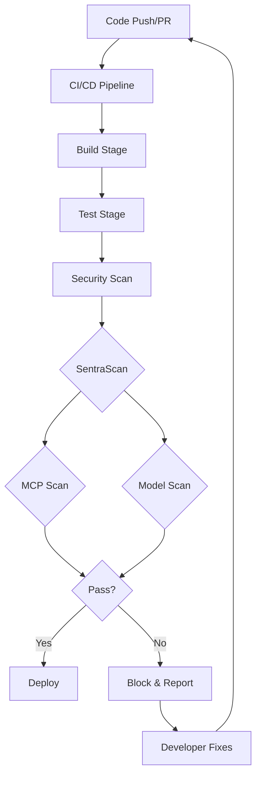

# CI/CD Integration Guide

Complete guide for integrating SentraScan Platform into your CI/CD pipelines.

## Table of Contents

1. [Overview](#overview)
2. [GitHub Actions](#github-actions)
3. [GitLab CI](#gitlab-ci)
4. [Jenkins](#jenkins)
5. [Azure DevOps](#azure-devops)
6. [CircleCI](#circleci)
7. [Best Practices](#best-practices)

---

## Overview

### Integration Patterns



### Benefits

- **Automated Security Checks** - No manual intervention
- **Early Detection** - Catch issues before production
- **Policy Enforcement** - Consistent security standards
- **Audit Trail** - Complete scan history
- **Blocking Gates** - Prevent insecure deployments

---

## GitHub Actions

### Basic Workflow

Create `.github/workflows/sentrascan.yml`:

```yaml
name: SentraScan Security Scan

on:
  push:
    branches: [main, develop]
  pull_request:
    branches: [main]

jobs:
  mcp-scan:
    runs-on: ubuntu-latest
    steps:
      - uses: actions/checkout@v4
      
      - name: Run MCP Scan
        uses: docker://sentrascan/platform:latest
        env:
          SENTRASCAN_API_KEY: ${{ secrets.SENTRASCAN_API_KEY }}
        with:
          args: scan mcp --auto-discover --policy .sentrascan.yaml
          
      - name: Upload Scan Report
        if: always()
        uses: actions/upload-artifact@v4
        with:
          name: mcp-scan-report
          path: reports/*.json
```

### Advanced Workflow with PR Comments

```yaml
name: SentraScan Security Scan

on:
  pull_request:
    branches: [main]

jobs:
  security-scan:
    runs-on: ubuntu-latest
    steps:
      - uses: actions/checkout@v4
      
      - name: Run MCP Scan
        id: scan
        uses: docker://sentrascan/platform:latest
        env:
          SENTRASCAN_API_KEY: ${{ secrets.SENTRASCAN_API_KEY }}
        with:
          args: scan mcp --auto-discover --policy .sentrascan.yaml --output scan-report.json
        continue-on-error: true
      
      - name: Parse Scan Results
        id: parse
        run: |
          if [ -f scan-report.json ]; then
            PASSED=$(jq -r '.gate_result.passed' scan-report.json)
            FINDINGS=$(jq -r '.gate_result.total_findings' scan-report.json)
            echo "passed=$PASSED" >> $GITHUB_OUTPUT
            echo "findings=$FINDINGS" >> $GITHUB_OUTPUT
          fi
      
      - name: Comment PR
        if: github.event_name == 'pull_request'
        uses: actions/github-script@v7
        with:
          script: |
            const fs = require('fs');
            const report = JSON.parse(fs.readFileSync('scan-report.json', 'utf8'));
            
            let body = '## 🔒 SentraScan Security Scan Results\n\n';
            body += `**Status:** ${report.gate_result.passed ? '✅ PASSED' : '❌ FAILED'}\n\n`;
            body += `**Findings:** ${report.gate_result.total_findings}\n\n`;
            
            if (report.findings && report.findings.length > 0) {
              body += '### Findings:\n\n';
              report.findings.slice(0, 10).forEach(f => {
                body += `- **${f.severity}:** ${f.title}\n`;
              });
            }
            
            github.rest.issues.createComment({
              issue_number: context.issue.number,
              owner: context.repo.owner,
              repo: context.repo.repo,
              body: body
            });
      
      - name: Fail if Scan Failed
        if: steps.parse.outputs.passed == 'false'
        run: exit 1
```

### Matrix Build for Multiple Configs

```yaml
jobs:
  scan-matrix:
    runs-on: ubuntu-latest
    strategy:
      matrix:
        config:
          - ~/.cursor/mcp.json
          - ~/.vscode/mcp.json
    steps:
      - uses: actions/checkout@v4
      
      - name: Scan ${{ matrix.config }}
        uses: docker://sentrascan/platform:latest
        with:
          args: scan mcp --config ${{ matrix.config }} --policy .sentrascan.yaml
```

---

## GitLab CI

### Basic Pipeline

Create `.gitlab-ci.yml`:

```yaml
stages:
  - build
  - security
  - deploy

mcp-scan:
  stage: security
  image: sentrascan/platform:latest
  script:
    - sentrascan scan mcp --auto-discover --policy .sentrascan.yaml
  artifacts:
    when: always
    reports:
      junit: reports/scan.xml
    paths:
      - reports/*.json
    expire_in: 30 days
  only:
    - merge_requests
    - main
```

### Advanced Pipeline with Merge Request Integration

```yaml
variables:
  SENTRASCAN_API_KEY: $SENTRASCAN_API_KEY

stages:
  - security

mcp-scan:
  stage: security
  image: sentrascan/platform:latest
  script:
    - |
      sentrascan scan mcp \
        --auto-discover \
        --policy .sentrascan.yaml \
        --output scan-report.json || SCAN_EXIT=$?
      
      # Parse results
      PASSED=$(jq -r '.gate_result.passed' scan-report.json)
      FINDINGS=$(jq -r '.gate_result.total_findings' scan-report.json)
      
      # Create MR comment
      if [ -n "$CI_MERGE_REQUEST_IID" ]; then
        curl -X POST \
          -H "PRIVATE-TOKEN: $GITLAB_TOKEN" \
          -H "Content-Type: application/json" \
          -d "{\"body\": \"## SentraScan Results\\n\\n**Status:** $([ \"$PASSED\" = \"true\" ] && echo '✅ PASSED' || echo '❌ FAILED')\\n**Findings:** $FINDINGS\"}" \
          "$CI_API_V4_URL/projects/$CI_PROJECT_ID/merge_requests/$CI_MERGE_REQUEST_IID/notes"
      fi
      
      # Fail if scan failed
      if [ "$PASSED" != "true" ]; then
        exit 1
      fi
  artifacts:
    when: always
    paths:
      - scan-report.json
    reports:
      junit: reports/scan.xml
  rules:
    - if: $CI_PIPELINE_SOURCE == "merge_request_event"
    - if: $CI_COMMIT_BRANCH == "main"
```

### Model Scan in Pipeline

```yaml
model-scan:
  stage: security
  image: sentrascan/platform:latest
  script:
    - |
      # Scan all model files
      for model in models/*.pkl models/*.pt models/*.onnx; do
        if [ -f "$model" ]; then
          sentrascan scan model "$model" \
            --sbom "${model}.sbom.json" \
            --policy .sentrascan.yaml || exit 1
        fi
      done
  artifacts:
    paths:
      - models/*.sbom.json
      - reports/*.json
```

---

## Jenkins

### Declarative Pipeline

Create `Jenkinsfile`:

```groovy
pipeline {
    agent any
    
    environment {
        SENTRASCAN_API_KEY = credentials('sentrascan-api-key')
    }
    
    stages {
        stage('Security Scan') {
            steps {
                sh '''
                    docker run --rm \
                        -v ${WORKSPACE}:/workspace \
                        -w /workspace \
                        -e SENTRASCAN_API_KEY=${SENTRASCAN_API_KEY} \
                        sentrascan/platform:latest \
                        scan mcp --auto-discover --policy .sentrascan.yaml
                '''
            }
        }
    }
    
    post {
        always {
            archiveArtifacts artifacts: 'reports/*.json', fingerprint: true
            publishHTML([
                reportDir: 'reports',
                reportFiles: 'scan-report.html',
                reportName: 'SentraScan Report'
            ])
        }
        failure {
            emailext (
                subject: "SentraScan Security Scan Failed: ${env.JOB_NAME}",
                body: "Security scan failed. Please review the findings.",
                to: "${env.CHANGE_AUTHOR_EMAIL}"
            )
        }
    }
}
```

### Scripted Pipeline

```groovy
node {
    stage('Checkout') {
        checkout scm
    }
    
    stage('Security Scan') {
        def scanResult = sh(
            script: '''
                docker run --rm \
                    -v ${WORKSPACE}:/workspace \
                    -w /workspace \
                    sentrascan/platform:latest \
                    scan mcp --auto-discover --policy .sentrascan.yaml \
                    --output scan-report.json
            ''',
            returnStatus: true
        )
        
        def report = readJSON file: 'scan-report.json'
        
        if (!report.gate_result.passed) {
            error("Security scan failed: ${report.gate_result.total_findings} findings")
        }
    }
    
    stage('Archive') {
        archiveArtifacts artifacts: 'reports/*.json', fingerprint: true
    }
}
```

---

## Azure DevOps

### YAML Pipeline

Create `azure-pipelines.yml`:

```yaml
trigger:
  branches:
    include:
      - main
      - develop

pool:
  vmImage: 'ubuntu-latest'

variables:
  - group: sentrascan-variables

stages:
  - stage: Security
    jobs:
      - job: MCPScan
        steps:
          - task: Docker@2
            displayName: 'Run MCP Scan'
            inputs:
              containerRegistryType: 'Docker Hub'
              command: 'run'
              arguments: |
                --rm
                -v $(System.DefaultWorkingDirectory):/workspace
                -w /workspace
                -e SENTRASCAN_API_KEY=$(SENTRASCAN_API_KEY)
                sentrascan/platform:latest
                scan mcp --auto-discover --policy .sentrascan.yaml
          
          - task: PublishTestResults@2
            displayName: 'Publish Scan Results'
            inputs:
              testResultsFormat: 'JUnit'
              testResultsFiles: 'reports/scan.xml'
              failTaskOnFailedTests: true
```

### Pipeline with Artifacts

```yaml
stages:
  - stage: Security
    jobs:
      - job: SecurityScan
        steps:
          - checkout: self
          
          - script: |
              docker run --rm \
                -v $(System.DefaultWorkingDirectory):/workspace \
                -w /workspace \
                sentrascan/platform:latest \
                scan mcp --auto-discover \
                --policy .sentrascan.yaml \
                --output scan-report.json
            displayName: 'Run Security Scan'
            continueOnError: true
          
          - task: PublishBuildArtifacts@1
            displayName: 'Publish Scan Report'
            inputs:
              pathToPublish: 'scan-report.json'
              artifactName: 'security-scan-report'
          
          - task: Bash@3
            displayName: 'Check Scan Results'
            inputs:
              targetType: 'inline'
              script: |
                if [ -f scan-report.json ]; then
                  PASSED=$(jq -r '.gate_result.passed' scan-report.json)
                  if [ "$PASSED" != "true" ]; then
                    echo "##vso[task.logissue type=error]Security scan failed"
                    exit 1
                  fi
                fi
```

---

## CircleCI

### Configuration

Create `.circleci/config.yml`:

```yaml
version: 2.1

jobs:
  security-scan:
    docker:
      - image: sentrascan/platform:latest
    steps:
      - checkout
      - run:
          name: Run MCP Scan
          command: |
            sentrascan scan mcp \
              --auto-discover \
              --policy .sentrascan.yaml \
              --output scan-report.json
      - store_artifacts:
          path: scan-report.json
          destination: security-scan-report

workflows:
  version: 2
  security:
    jobs:
      - security-scan
```

### With Notifications

```yaml
jobs:
  security-scan:
    docker:
      - image: sentrascan/platform:latest
    steps:
      - checkout
      - run:
          name: Run Security Scan
          command: |
            sentrascan scan mcp --auto-discover --policy .sentrascan.yaml
          no_output_timeout: 10m
      - run:
          name: Notify on Failure
          command: |
            if [ $? -ne 0 ]; then
              curl -X POST $SLACK_WEBHOOK_URL \
                -H 'Content-Type: application/json' \
                -d '{"text":"Security scan failed in CircleCI"}'
            fi
          when: on_fail
```

---

## Best Practices

### 1. Policy Configuration

**Version Control Policies:**
```bash
# Commit policy file
git add .sentrascan.yaml
git commit -m "Add SentraScan policy"
```

**Environment-Specific Policies:**
```yaml
# .sentrascan-dev.yaml (development)
mcp:
  severity_threshold: MEDIUM  # More lenient

# .sentrascan-prod.yaml (production)
mcp:
  severity_threshold: HIGH  # Stricter
```

### 2. Caching

**GitHub Actions:**
```yaml
- name: Cache Docker layers
  uses: actions/cache@v3
  with:
    path: /tmp/.buildx-cache
    key: ${{ runner.os }}-buildx-${{ github.sha }}
```

### 3. Parallel Scanning

```yaml
jobs:
  scan-mcp:
    # ... MCP scan
    
  scan-models:
    # ... Model scan
    
  scan-all:
    needs: [scan-mcp, scan-models]
    # ... Aggregate results
```

### 4. Conditional Execution

```yaml
# Only scan on changes to MCP configs
- name: Check for MCP changes
  id: check
  run: |
    if git diff --name-only ${{ github.event.before }} ${{ github.sha }} | grep -q "mcp.json"; then
      echo "changed=true" >> $GITHUB_OUTPUT
    fi

- name: Run Scan
  if: steps.check.outputs.changed == 'true'
  run: sentrascan scan mcp --auto-discover
```

### 5. Timeout Management

```yaml
- name: Run Scan with Timeout
  timeout-minutes: 10
  run: |
    sentrascan scan mcp --auto-discover --timeout 300
```

### 6. Artifact Management

```yaml
- name: Upload Reports
  uses: actions/upload-artifact@v4
  with:
    name: security-reports
    path: |
      reports/*.json
      reports/*.md
    retention-days: 90
```

### 7. Secret Management

**Never commit API keys:**
```yaml
# ❌ Bad
env:
  API_KEY: "sk-1234567890"

# ✅ Good
env:
  API_KEY: ${{ secrets.SENTRASCAN_API_KEY }}
```

### 8. Error Handling

```yaml
- name: Run Scan
  id: scan
  continue-on-error: true
  run: sentrascan scan mcp --auto-discover

- name: Check Results
  if: steps.scan.outcome == 'failure'
  run: |
    echo "Scan failed but continuing..."
    # Send notification
```

---

## Troubleshooting

### Common Issues

**1. Docker Image Not Found**
```yaml
# Use specific tag
image: sentrascan/platform:0.1.0
```

**2. Permission Denied**
```yaml
# Add user permissions
docker run --rm -u $(id -u):$(id -g) ...
```

**3. Timeout Issues**
```yaml
# Increase timeout
timeout-minutes: 15
```

**4. Policy Not Found**
```yaml
# Use absolute path
--policy $(pwd)/.sentrascan.yaml
```

---

## Next Steps

**Integration:**
- [API Client Examples](API-CLIENT-EXAMPLES.md) - Code examples in multiple languages
- [User Guide](USER-GUIDE.md) - Complete usage guide

**Operations:**
- [Administrator Guide](ADMIN-GUIDE.md) - Production deployment
- [Runbooks](RUNBOOKS.md) - Operational procedures
- [Monitoring Guide](MONITORING.md) - Observability setup

**Reference:**
- [Technical Documentation](TECHNICAL-DOCUMENTATION.md#api-documentation) - Complete API reference
- [Documentation Index](README.md) - Complete documentation overview

---

**Need Help?** Check the [Documentation Index](README.md) or [open an issue](https://github.com/your-repo/issues).

