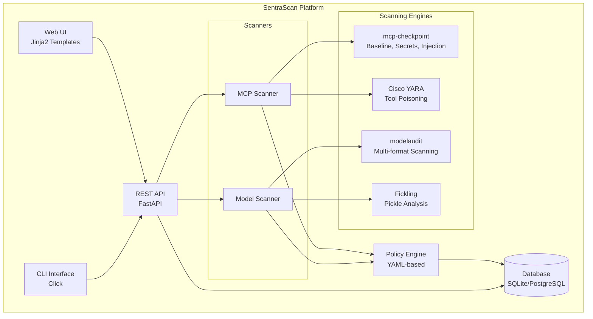
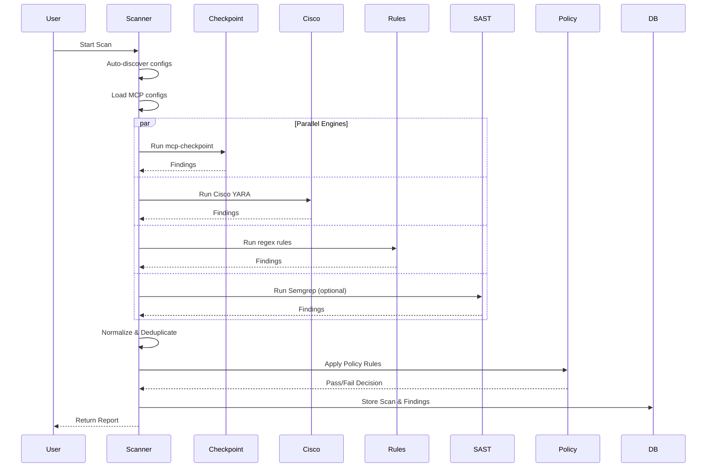
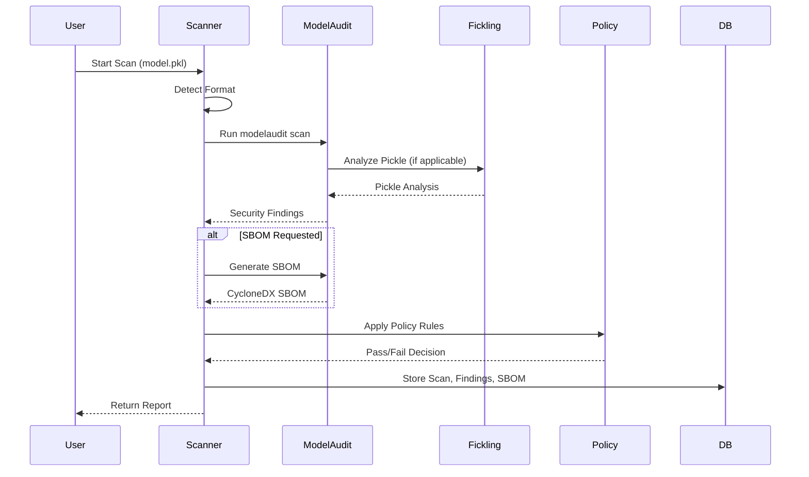

# SentraScan Platform - Technical Documentation

## Table of Contents

1. [Architecture Overview](#architecture-overview)
2. [System Components](#system-components)
3. [API Documentation](#api-documentation)
4. [Database Schema](#database-schema)
5. [Module Details](#module-details)
6. [Deployment Guide](#deployment-guide)
7. [Development Guide](#development-guide)
8. [Configuration](#configuration)
9. [Security Considerations](#security-considerations)
10. [Troubleshooting](#troubleshooting)

---

## Architecture Overview

### System Architecture

SentraScan Platform is a unified security scanning system for MCP (Model Context Protocol) configurations and ML models. It consists of:



### Technology Stack

**Backend:**
- **Language:** Python 3.11+
- **Web Framework:** FastAPI 0.110+
- **Database:** SQLite (default) / PostgreSQL 15+ (optional)
- **ORM:** SQLAlchemy 2.0+
- **Templates:** Jinja2 3.1.3+

**Scanning Engines:**
- **MCP Scanning:**
  - `mcp-checkpoint` 2.0.0 - Baseline drift, secrets, command injection
  - `cisco-ai-mcp-scanner` 3.2.1 - YARA-based tool poisoning detection
- **Model Scanning:**
  - `modelaudit` 0.2.17 - Multi-format model scanning
  - `semgrep` 1.84.0 - SAST scanning

**Infrastructure:**
- **Containerization:** Docker 24+
- **Orchestration:** Docker Compose
- **Web Server:** Uvicorn (ASGI)

---

## System Components

### 1. CLI Interface (`src/sentrascan/cli.py`)

The command-line interface provides direct access to scanning capabilities:

**Commands:**
- `sentrascan scan model <path>` - Scan ML model files
- `sentrascan scan mcp [--auto-discover]` - Scan MCP configurations
- `sentrascan server [--host] [--port]` - Start REST API server
- `sentrascan db init` - Initialize database
- `sentrascan auth create` - Create API keys
- `sentrascan doctor` - System diagnostics

**Example Usage:**
```bash
# Scan a model file
sentrascan scan model model.pkl --sbom model.sbom.json --strict

# Scan MCP configs with auto-discovery
sentrascan scan mcp --auto-discover --policy .sentrascan.yaml

# Start server
sentrascan server --host 0.0.0.0 --port 8200
```

### 2. REST API Server (`src/sentrascan/server.py`)

FastAPI-based REST API with the following key components:

**Authentication:**
- API key-based authentication via `X-API-Key` header
- Session-based authentication for web UI (signed cookies)
- Role-based access control (admin, viewer)

**Job Queue:**
- Simple in-memory queue for asynchronous scan execution
- Background worker thread (`JobRunner`) processes queued scans
- Supports both synchronous and asynchronous scan modes

**Key Endpoints:**
- `/api/v1/health` - Health check
- `/api/v1/models/scans` - Trigger model scan
- `/api/v1/mcp/scans` - Trigger MCP scan
- `/api/v1/scans` - List scans
- `/api/v1/scans/{id}` - Get scan details
- `/api/v1/baselines` - Baseline management
- `/api/v1/policies` - Policy management

### 3. Web UI (`src/sentrascan/web/templates/`)

Jinja2-based web interface with the following pages:

- **Login** (`login.html`) - API key authentication
- **Dashboard** (`index.html`) - Scan list with filtering
- **Scan Detail** (`scan_detail.html`) - Detailed scan results
- **Scan Forms** (`scan_forms.html`) - Trigger new scans
- **Baselines** (`baselines.html`) - Baseline management
- **Baseline Compare** (`baseline_compare.html`) - Compare baselines

### 4. Core Modules

#### 4.1 Storage (`src/sentrascan/core/storage.py`)

Database initialization and session management:
- SQLAlchemy Base class definition
- Database connection pooling
- Session factory for dependency injection

#### 4.2 Models (`src/sentrascan/core/models.py`)

SQLAlchemy ORM models:

- **Scan** - Scan execution records
- **Finding** - Security findings from scans
- **Baseline** - Approved configuration snapshots
- **APIKey** - API authentication keys
- **SBOM** - Software Bill of Materials

#### 4.3 Policy Engine (`src/sentrascan/core/policy.py`)

YAML-based policy enforcement:

```python
@dataclass
class Policy:
    severity_threshold: str  # LOW, MEDIUM, HIGH, CRITICAL
    block_issues: List[str]  # Issue types to block
    sbom_requirements: Dict[str, Any] | None
```

**Policy Evaluation:**
- Severity-based gating (blocks if findings exceed threshold)
- Issue type filtering (blocks specific issue types)
- SBOM requirements validation

---

## API Documentation

### Authentication

All API endpoints (except `/api/v1/health`) require authentication via API key:

```http
X-API-Key: your-api-key-here
```

**Creating API Keys:**
```bash
sentrascan auth create --name "ci-cd-key" --role admin
```

**Roles:**
- `admin` - Full access (can trigger scans, manage baselines)
- `viewer` - Read-only access (can view scans, findings)

### Endpoints

#### Health Check

```http
GET /api/v1/health
```

**Response:**
```json
{
  "status": "ok"
}
```

#### Model Scan

```http
POST /api/v1/models/scans
Content-Type: application/json
X-API-Key: <key>

{
  "paths": ["model.pkl"],
  "model_path": "model.pkl",  // Alternative to paths
  "generate_sbom": true,
  "strict": false,
  "policy": "/path/to/policy.yaml",
  "timeout": 0
}
```

**Response:**
```json
{
  "scan_id": "uuid",
  "timestamp": "2025-01-20T10:00:00Z",
  "gate_result": {
    "passed": true,
    "total_findings": 0,
    "critical_count": 0,
    "high_count": 0
  },
  "findings": [],
  "metadata": {
    "scan_duration_ms": 1234,
    "servers_scanned": 1
  }
}
```

#### MCP Scan

```http
POST /api/v1/mcp/scans
Content-Type: application/json
X-API-Key: <key>

{
  "config_paths": ["/path/to/mcp.json"],
  "auto_discover": true,
  "policy": "/path/to/policy.yaml",
  "timeout": 60
}
```

**Response:** Same format as model scan

#### List Scans

```http
GET /api/v1/scans?type=mcp&passed=true&limit=50&offset=0
X-API-Key: <key>
```

**Query Parameters:**
- `type` - Filter by scan type (`model` or `mcp`)
- `passed` - Filter by pass/fail (`true` or `false`)
- `limit` - Results per page (max 200, default 50)
- `offset` - Pagination offset

**Response:**
```json
[
  {
    "id": "uuid",
    "created_at": "2025-01-20T10:00:00Z",
    "type": "mcp",
    "target": "auto",
    "passed": true,
    "critical": 0,
    "high": 0,
    "medium": 0,
    "low": 0
  }
]
```

#### Get Scan Details

```http
GET /api/v1/scans/{scan_id}
X-API-Key: <key>
```

**Response:**
```json
{
  "scan": {
    "id": "uuid",
    "created_at": "2025-01-20T10:00:00Z",
    "type": "mcp",
    "target": "auto",
    "passed": true,
    "critical": 0,
    "high": 0,
    "medium": 0,
    "low": 0
  },
  "findings": [
    {
      "id": "uuid",
      "scanner": "mcp-checkpoint",
      "severity": "HIGH",
      "category": "command_injection",
      "title": "Command injection detected",
      "description": "...",
      "location": "tool:execute_command"
    }
  ]
}
```

#### Baseline Management

**List Baselines:**
```http
GET /api/v1/baselines
X-API-Key: <key>
```

**Get Baseline:**
```http
GET /api/v1/baselines/{baseline_id}
X-API-Key: <key>
```

**Create Baseline:**
```http
POST /api/v1/baselines
Content-Type: application/json
X-API-Key: <key>

{
  "baseline_type": "mcp",
  "name": "production-baseline",
  "description": "Approved production MCP config",
  "content": {...},
  "target_hash": "abc123...",
  "scan_id": "uuid",
  "approved_by": "user@org.com"
}
```

**Compare Baselines:**
```http
POST /api/v1/baselines/compare
Content-Type: application/json
X-API-Key: <key>

{
  "left_id": "uuid1",
  "right_id": "uuid2"
}
```

**Response:**
```json
{
  "diff": [
    {
      "path": "servers[0].tools[0].name",
      "change": "changed",
      "from": "old_tool",
      "to": "new_tool"
    }
  ]
}
```

### Error Responses

All endpoints return standard HTTP status codes:

- `200` - Success
- `201` - Created
- `400` - Bad Request (validation error)
- `401` - Unauthorized (missing/invalid API key)
- `403` - Forbidden (insufficient role)
- `404` - Not Found
- `500` - Internal Server Error

**Error Format:**
```json
{
  "detail": "Error message"
}
```

---

## Database Schema

### Tables

#### Scans

```sql
CREATE TABLE scans (
    id VARCHAR PRIMARY KEY,
    created_at TIMESTAMP NOT NULL,
    scan_type VARCHAR NOT NULL,  -- 'mcp' or 'model'
    target_path VARCHAR NOT NULL,
    target_format VARCHAR,
    target_hash VARCHAR,
    scan_status VARCHAR DEFAULT 'completed',
    passed BOOLEAN DEFAULT FALSE,
    duration_ms INTEGER DEFAULT 0,
    total_findings INTEGER DEFAULT 0,
    critical_count INTEGER DEFAULT 0,
    high_count INTEGER DEFAULT 0,
    medium_count INTEGER DEFAULT 0,
    low_count INTEGER DEFAULT 0,
    baseline_id VARCHAR,
    sbom_id VARCHAR,
    meta JSON
);
```

#### Findings

```sql
CREATE TABLE findings (
    id VARCHAR PRIMARY KEY,
    scan_id VARCHAR REFERENCES scans(id) ON DELETE CASCADE,
    module VARCHAR NOT NULL,
    scanner VARCHAR NOT NULL,
    severity VARCHAR NOT NULL,
    category VARCHAR NOT NULL,
    title VARCHAR NOT NULL,
    description TEXT,
    location VARCHAR,
    evidence JSON,
    remediation TEXT
);
```

#### Baselines

```sql
CREATE TABLE baselines (
    id VARCHAR PRIMARY KEY,
    created_at TIMESTAMP NOT NULL,
    baseline_type VARCHAR NOT NULL,  -- 'mcp' or 'model'
    name VARCHAR NOT NULL,
    description TEXT,
    target_hash VARCHAR,
    content JSON,
    scan_id VARCHAR,
    sbom_id VARCHAR,
    approved_by VARCHAR,
    approval_date TIMESTAMP,
    is_active BOOLEAN DEFAULT TRUE
);
```

#### API Keys

```sql
CREATE TABLE api_keys (
    id VARCHAR PRIMARY KEY,
    name VARCHAR,
    role VARCHAR DEFAULT 'viewer',
    key_hash VARCHAR UNIQUE NOT NULL,
    is_revoked BOOLEAN DEFAULT FALSE,
    created_at TIMESTAMP NOT NULL
);
```

#### SBOMs

```sql
CREATE TABLE sboms (
    id VARCHAR PRIMARY KEY,
    created_at TIMESTAMP NOT NULL,
    model_name VARCHAR,
    model_version VARCHAR,
    bom_format VARCHAR,
    spec_version VARCHAR,
    content JSON,
    hash VARCHAR
);
```

### Relationships

- `findings.scan_id` → `scans.id` (CASCADE DELETE)
- `scans.baseline_id` → `baselines.id` (optional)
- `scans.sbom_id` → `sboms.id` (optional)

### Indexes

Recommended indexes for performance:

```sql
CREATE INDEX idx_scans_created_at ON scans(created_at DESC);
CREATE INDEX idx_scans_type ON scans(scan_type);
CREATE INDEX idx_scans_passed ON scans(passed);
CREATE INDEX idx_findings_scan_id ON findings(scan_id);
CREATE INDEX idx_findings_severity ON findings(severity);
CREATE INDEX idx_baselines_type ON baselines(baseline_type);
CREATE INDEX idx_baselines_active ON baselines(is_active);
```

---

## Module Details

### MCP Scanner (`src/sentrascan/modules/mcp/scanner.py`)

**Purpose:** Scan MCP server configurations for security vulnerabilities.

**Key Features:**
1. **Auto-Discovery** - Finds MCP configs in standard locations:
   - Claude Desktop: `~/Library/Application Support/Claude/`
   - Cursor: `~/.cursor/mcp.json`
   - Windsurf: `~/.codeium/windsurf/mcp_config.json`
   - VS Code: `~/.vscode/mcp.json`

2. **Dual-Engine Scanning:**
   - **mcp-checkpoint** - Baseline drift, secrets, command injection
   - **Cisco Scanner (YARA)** - Tool poisoning patterns

3. **Baseline Management:**
   - Create approved snapshots
   - Detect unauthorized changes (rug pull attacks)
   - Hash-based integrity verification

**Scanning Process:**



**Sub-modules:**
- `handshake.py` - MCP protocol handshake
- `probe_runtime.py` - Runtime probing capabilities
- `rules.py` - Custom rule definitions
- `sast.py` - Static analysis (Semgrep)
- `secrets.py` - Secrets detection (TruffleHog, Gitleaks)
- `zap.py` - OWASP ZAP integration (optional)

### Model Scanner (`src/sentrascan/modules/model/scanner.py`)

**Purpose:** Scan ML model files for security vulnerabilities and generate SBOMs.

**Key Features:**
1. **Multi-Format Support** - 30+ model formats:
   - Pickle, PyTorch, TensorFlow, ONNX, GGUF
   - SafeTensors, H5, Keras, XGBoost, Flax/JAX
   - TensorRT, TFLite, OpenVINO, PMML, NumPy

2. **Security Detection:**
   - Deserialization attacks
   - Arbitrary code execution
   - OS command execution
   - File system access

3. **SBOM Generation:**
   - CycloneDX 1.6 format
   - Automatic dependency extraction
   - Version tracking

**Scanning Process:**



**Input Sources:**
- Local filesystem
- Hugging Face Hub
- MLflow
- S3 (AWS)
- GCS (Google Cloud Storage)

---

## Deployment Guide

### Docker Compose Deployment

**Prerequisites:**
- Docker 24+
- Docker Compose 2.0+
- 2GB RAM minimum
- 10GB disk space

**Quick Start:**
```bash
# Clone repository
git clone <repo-url>
cd sentrascan-platform

# Start services
docker-compose up -d

# Initialize database
docker-compose exec api sentrascan db init

# Create API key
docker-compose exec api sentrascan auth create --name admin --role admin
```

**Access Points:**
- Web UI: `http://localhost:8200`
- REST API: `http://localhost:8200/api/v1`
- API Docs: `http://localhost:8200/docs`

### Environment Variables

**API Service:**
```bash
DATABASE_URL=postgresql+psycopg2://user:pass@db:5432/sentrascan
MODELAUDIT_CACHE_DIR=/cache
SENTRASCAN_SESSION_COOKIE=ss_session
SENTRASCAN_SECRET=your-secret-key-here
```

**Database Service:**
```bash
POSTGRES_DB=sentrascan
POSTGRES_USER=sentrascan
POSTGRES_PASSWORD=changeme
```

### Volumes

- `./data` - Database files (SQLite) or PostgreSQL data
- `./reports` - Scan report outputs
- `./sboms` - Generated SBOM files
- `./cache` - Model cache directory

### Production Considerations

1. **Database:** Use PostgreSQL for production (configured in `docker-compose.yml`)
2. **Secrets:** Set strong `SENTRASCAN_SECRET` for session signing
3. **HTTPS:** Use reverse proxy (nginx/traefik) with TLS
4. **Backups:** Regular database backups
5. **Monitoring:** Add health check endpoints and logging
6. **Scaling:** Use external job queue (Redis/RabbitMQ) for horizontal scaling

---

## Development Guide

### Setup Development Environment

```bash
# Clone repository
git clone <repo-url>
cd sentrascan-platform

# Create virtual environment
python3.11 -m venv venv
source venv/bin/activate  # On Windows: venv\Scripts\activate

# Install dependencies
pip install -e .

# Install development dependencies
pip install pytest pytest-asyncio black ruff mypy

# Initialize database
sentrascan db init
```

### Project Structure

```
sentrascan-platform/
├── src/sentrascan/
│   ├── __init__.py
│   ├── cli.py              # CLI interface
│   ├── server.py           # FastAPI server
│   ├── core/
│   │   ├── models.py       # Database models
│   │   ├── policy.py       # Policy engine
│   │   └── storage.py      # Database setup
│   ├── modules/
│   │   ├── mcp/            # MCP scanner module
│   │   │   ├── scanner.py
│   │   │   ├── handshake.py
│   │   │   ├── secrets.py
│   │   │   └── ...
│   │   └── model/          # Model scanner module
│   │       └── scanner.py
│   └── web/
│       └── templates/      # Jinja2 templates
├── tests/                  # Test suite
├── docs/                   # Documentation
├── docker-compose.yml      # Docker Compose config
├── Dockerfile             # Container image
└── pyproject.toml         # Project metadata
```

### Running Tests

```bash
# Run all tests
pytest

# Run specific test file
pytest tests/test_mcp_pipeline.py

# Run with coverage
pytest --cov=src/sentrascan --cov-report=html

# Run integration tests (requires docker-compose)
pytest -m integration
```

### Code Style

**Formatting:**
```bash
black src/ tests/
```

**Linting:**
```bash
ruff check src/ tests/
```

**Type Checking:**
```bash
mypy src/
```

### Adding New Features

1. **New Scanner Module:**
   - Create module in `src/sentrascan/modules/<module_name>/`
   - Implement `Scanner` class with `scan()` and `to_report()` methods
   - Add CLI command in `cli.py`
   - Add API endpoint in `server.py`

2. **New Database Model:**
   - Add model class in `src/sentrascan/core/models.py`
   - Create migration (if using Alembic)
   - Update API endpoints

3. **New Policy Rule:**
   - Extend `Policy` dataclass in `policy.py`
   - Update `PolicyEngine.gate()` method
   - Add tests

---

## Configuration

### Policy Configuration

Policy files are YAML-based and can be module-specific or unified:

**Unified Policy (`sentrascan.yaml`):**
```yaml
model:
  severity_threshold: HIGH
  block_issues:
    - arbitrary_code_execution
    - os_command_execution
    - file_system_access
  sbom_requirements:
    require_sbom: true

mcp:
  severity_threshold: HIGH
  block_issues:
    - tool_poisoning
    - command_injection
    - baseline_drift
    - hardcoded_secrets
```

**Module-Specific Policy:**
```yaml
# .sentrascan-model.yaml
severity_threshold: HIGH
block_issues:
  - arbitrary_code_execution
sbom_requirements:
  require_sbom: true
```

### Default Policies

**Model Default:**
- Severity threshold: `HIGH`
- Blocked issues: `arbitrary_code_execution`, `os_command_execution`, `file_system_access`
- SBOM required: `true`

**MCP Default:**
- Severity threshold: `HIGH`
- Blocked issues: `tool_poisoning`, `command_injection`, `baseline_drift`, `hardcoded_secrets`

### Severity Levels

- `CRITICAL` - Immediate security risk
- `HIGH` - Significant security risk
- `MEDIUM` - Moderate security risk
- `LOW` - Minor security risk
- `INFO` - Informational finding

---

## Security Considerations

### Authentication & Authorization

1. **API Keys:**
   - Keys are hashed using SHA-256 before storage
   - Never stored in plaintext
   - Can be revoked via `is_revoked` flag

2. **Session Management:**
   - Web UI uses signed cookies (HMAC-SHA256)
   - Secret key must be strong and kept secure
   - Set via `SENTRASCAN_SECRET` environment variable

3. **Role-Based Access Control:**
   - `admin` role: Full access (scans, baselines, policies)
   - `viewer` role: Read-only access

### Data Security

1. **Database:**
   - Use PostgreSQL with encrypted connections in production
   - Enable database encryption at rest
   - Regular backups with encryption

2. **Secrets:**
   - Never commit API keys or secrets to version control
   - Use environment variables or secret management systems
   - Rotate secrets regularly

3. **Network:**
   - Use HTTPS/TLS for API endpoints in production
   - Configure CORS appropriately
   - Rate limiting (future enhancement)

### Input Validation

- All API endpoints validate input using Pydantic models
- File paths are sanitized before use
- Timeout limits prevent resource exhaustion

### Audit Logging

- All scan operations are logged in database
- Baseline changes tracked with approver information
- API key usage can be tracked (future enhancement)

---

## Troubleshooting

### Common Issues

#### 1. Database Connection Errors

**Symptoms:**
```
sqlalchemy.exc.OperationalError: (psycopg2.OperationalError) ...
```

**Solutions:**
- Verify `DATABASE_URL` environment variable
- Check PostgreSQL service is running: `docker-compose ps db`
- Verify credentials match `docker-compose.yml`
- Check database exists: `docker-compose exec db psql -U sentrascan -d sentrascan`

#### 2. Scanner Dependencies Missing

**Symptoms:**
```
ModuleNotFoundError: No module named 'mcp_checkpoint'
```

**Solutions:**
- Rebuild Docker image: `docker-compose build --no-cache`
- Verify dependencies in `Dockerfile`
- Check Python version (requires 3.11+)

#### 3. Scan Timeouts

**Symptoms:**
- Scans hang indefinitely
- Timeout errors

**Solutions:**
- Increase timeout in scan request: `"timeout": 120`
- Check system resources (CPU, memory)
- Verify scanner processes are not stuck
- Check logs: `docker-compose logs api`

#### 4. Policy Not Applied

**Symptoms:**
- Scans pass when they should fail
- Policy file not found errors

**Solutions:**
- Verify policy file path is correct
- Check YAML syntax is valid
- Ensure policy file is mounted in container (if using Docker)
- Use absolute paths for policy files

#### 5. Web UI Authentication Issues

**Symptoms:**
- Cannot log in
- Session expires immediately

**Solutions:**
- Verify `SENTRASCAN_SECRET` is set and consistent
- Clear browser cookies
- Check API key is valid: `sentrascan auth create --name test --role admin`
- Verify session cookie is set correctly

### Debug Mode

Enable verbose logging:

```bash
# Set environment variable
export LOG_LEVEL=debug

# Or in docker-compose.yml
environment:
  - LOG_LEVEL=debug
```

### Health Checks

Check system health:

```bash
# API health
curl http://localhost:8200/api/v1/health

# Database connection
docker-compose exec api sentrascan db init

# Scanner diagnostics
docker-compose exec api sentrascan doctor
```

### Logs

View logs:

```bash
# All services
docker-compose logs

# Specific service
docker-compose logs api

# Follow logs
docker-compose logs -f api
```

---

## Next Steps

**For Developers:**
- [API Client Examples](API-CLIENT-EXAMPLES.md) - Integration code examples
- [CI/CD Integration](INTEGRATION-CICD.md) - Pipeline integration
- [Development Guide](#development-guide) - Development setup

**For Administrators:**
- [Administrator Guide](ADMIN-GUIDE.md) - Production deployment
- [Security Considerations](#security-considerations) - Security best practices
- [Runbooks](RUNBOOKS.md) - Operational procedures

**Documentation:**
- [Documentation Index](README.md) - Complete documentation overview

---

## Appendix

### A. API Response Examples

**Successful Scan:**
```json
{
  "scan_id": "550e8400-e29b-41d4-a716-446655440000",
  "timestamp": "2025-01-20T10:30:45Z",
  "gate_result": {
    "passed": true,
    "total_findings": 0,
    "blocking_findings": 0,
    "critical_count": 0,
    "high_count": 0,
    "medium_count": 0,
    "low_count": 0
  },
  "findings": [],
  "metadata": {
    "scan_duration_ms": 1234,
    "servers_scanned": 3,
    "engines_used": ["mcp-checkpoint", "cisco-yara"]
  }
}
```

**Failed Scan:**
```json
{
  "scan_id": "550e8400-e29b-41d4-a716-446655440000",
  "timestamp": "2025-01-20T10:30:45Z",
  "gate_result": {
    "passed": false,
    "total_findings": 3,
    "blocking_findings": 2,
    "critical_count": 0,
    "high_count": 2,
    "medium_count": 1,
    "low_count": 0
  },
  "findings": [
    {
      "id": "finding-001",
      "scanner": "mcp-checkpoint",
      "severity": "HIGH",
      "category": "command_injection",
      "title": "Command injection detected",
      "description": "Tool contains shell command patterns",
      "location": "tool:execute_command",
      "evidence": {
        "tool_name": "execute_command",
        "server": "claude-desktop"
      },
      "remediation": "Review tool implementation and remove shell command execution"
    }
  ],
  "metadata": {
    "scan_duration_ms": 2340,
    "servers_scanned": 3,
    "engines_used": ["mcp-checkpoint", "cisco-yara"]
  }
}
```

### B. CI/CD Integration Examples

**GitHub Actions:**
```yaml
name: MCP Security Scan

on: [push, pull_request]

jobs:
  scan:
    runs-on: ubuntu-latest
    steps:
      - uses: actions/checkout@v3
      - name: Run SentraScan
        uses: docker://sentrascan/platform:latest
        with:
          args: scan mcp --auto-discover --policy .sentrascan.yaml
```

**GitLab CI:**
```yaml
mcp-scan:
  image: sentrascan/platform:latest
  script:
    - sentrascan scan mcp --auto-discover --policy .sentrascan.yaml
  artifacts:
    reports:
      - reports/scan.json
```

### C. Performance Benchmarks

**Typical Scan Times:**
- MCP scan (3 servers): 5-15 seconds
- Model scan (single file): 2-10 seconds
- Model scan with SBOM: 5-20 seconds

**Resource Usage:**
- Memory: 200-500 MB per scan
- CPU: Single-threaded, moderate usage
- Disk: Minimal (caching may use 100-500 MB)

### D. References

- [FastAPI Documentation](https://fastapi.tiangolo.com/)
- [SQLAlchemy Documentation](https://docs.sqlalchemy.org/)
- [MCP Protocol Specification](https://modelcontextprotocol.io/)
- [CycloneDX SBOM Specification](https://cyclonedx.org/)
- [mcp-checkpoint Documentation](https://github.com/aira-security/mcp-checkpoint)
- [modelaudit Documentation](https://github.com/protectai/modelaudit)

---

**Document Version:** 1.0  
**Last Updated:** January 2025  
**Maintainer:** SentraScan Team

