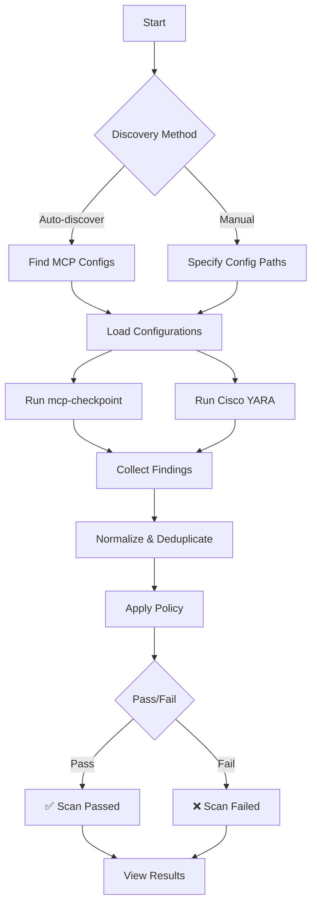
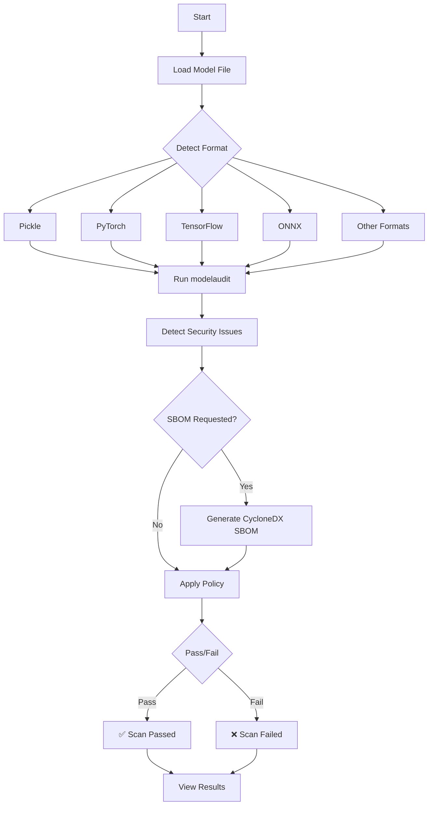
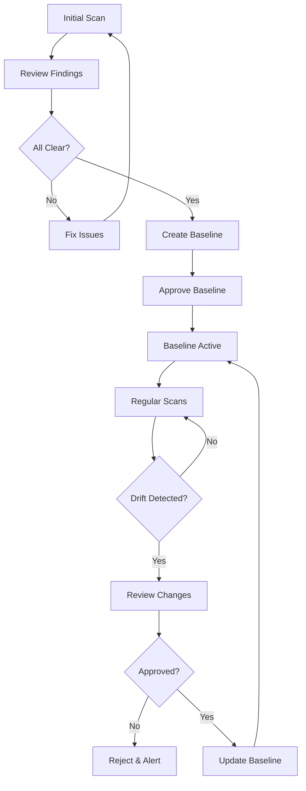

# SentraScan Platform - User Guide

Complete guide for using SentraScan Platform to secure your MCP configurations and ML models.

## Table of Contents

1. [Getting Started](#getting-started)
2. [Scanning MCP Configurations](#scanning-mcp-configurations)
3. [Scanning ML Models](#scanning-ml-models)
4. [Understanding Results](#understanding-results)
5. [Managing Baselines](#managing-baselines)
6. [Configuring Policies](#configuring-policies)
7. [Remediation Strategies](#remediation-strategies)
8. [Best Practices](#best-practices)

---

## Getting Started

### Prerequisites

- SentraScan Platform installed and running (see [Quick Start Guide](QUICK-START.md))
- API key with appropriate permissions
- Access to MCP configuration files or ML model files

### Authentication

**API Key:**
```bash
# Create API key (if you have admin access)
sentrascan auth create --name "my-key" --role admin

# Use in API requests
curl -H "X-API-Key: your-api-key" ...
```

**Web UI:**
1. Navigate to http://localhost:8200
2. Enter your API key
3. Click "Login"

---

## Scanning MCP Configurations

### Workflow Overview



### Method 1: Auto-Discovery

Automatically finds MCP configurations in standard locations:

**CLI:**
```bash
sentrascan scan mcp --auto-discover
```

**API:**
```bash
curl -X POST http://localhost:8200/api/v1/mcp/scans \
  -H "X-API-Key: your-api-key" \
  -H "Content-Type: application/json" \
  -d '{
    "auto_discover": true
  }'
```

**Discovered Locations:**
- Claude Desktop: `~/Library/Application Support/Claude/`
- Cursor: `~/.cursor/mcp.json`
- Windsurf: `~/.codeium/windsurf/mcp_config.json`
- VS Code: `~/.vscode/mcp.json`

### Method 2: Manual Configuration

Specify exact configuration files:

**CLI:**
```bash
sentrascan scan mcp --config ~/.cursor/mcp.json --config /path/to/other.json
```

**API:**
```bash
curl -X POST http://localhost:8200/api/v1/mcp/scans \
  -H "X-API-Key: your-api-key" \
  -H "Content-Type: application/json" \
  -d '{
    "config_paths": [
      "~/.cursor/mcp.json",
      "/path/to/other.json"
    ]
  }'
```

### Method 3: Git Repository URLs

Scan MCP servers from Git repositories:

**CLI:**
```bash
sentrascan scan mcp --config https://github.com/user/mcp-server.git
```

The scanner will:
1. Clone the repository
2. Extract MCP configuration
3. Scan the codebase for security issues

### Advanced Options

**With Custom Policy:**
```bash
sentrascan scan mcp --auto-discover --policy .sentrascan.yaml
```

**With Timeout:**
```bash
sentrascan scan mcp --auto-discover --timeout 120
```

**Output to File:**
```bash
sentrascan scan mcp --auto-discover --output scan-report.json
```

---

## Scanning ML Models

### Workflow Overview



### Supported Formats

SentraScan supports 30+ model formats:
- **Pickle** (.pkl, .pickle)
- **PyTorch** (.pt, .pth)
- **TensorFlow** (.pb, .h5, .savedmodel)
- **ONNX** (.onnx)
- **GGUF** (.gguf)
- **SafeTensors** (.safetensors)
- **H5/Keras** (.h5, .keras)
- **XGBoost** (.xgb, .json)
- **Flax/JAX** (.flax, .msgpack)
- **TensorRT** (.engine, .plan)
- **TFLite** (.tflite)
- **OpenVINO** (.xml, .bin)
- **PMML** (.pmml)
- **NumPy** (.npy, .npz)
- And more...

### Basic Model Scan

**CLI:**
```bash
# Single model
sentrascan scan model model.pkl

# Multiple models
sentrascan scan model model1.pkl model2.pt model3.onnx
```

**API:**
```bash
curl -X POST http://localhost:8200/api/v1/models/scans \
  -H "X-API-Key: your-api-key" \
  -H "Content-Type: application/json" \
  -d '{
    "paths": ["model.pkl"]
  }'
```

### Scan with SBOM Generation

**CLI:**
```bash
sentrascan scan model model.pkl --sbom model.sbom.json
```

**API:**
```bash
curl -X POST http://localhost:8200/api/v1/models/scans \
  -H "X-API-Key: your-api-key" \
  -H "Content-Type: application/json" \
  -d '{
    "paths": ["model.pkl"],
    "generate_sbom": true
  }'
```

### Strict Mode

Enable strict mode for more aggressive scanning:

```bash
sentrascan scan model model.pkl --strict
```

Strict mode:
- Fails on warnings
- Enforces stricter policy rules
- Detects more potential issues

### Remote Model Sources

**Hugging Face:**
```bash
sentrascan scan model hf://username/model-name
```

**MLflow:**
```bash
sentrascan scan model mlflow://model-uri
```

**S3:**
```bash
sentrascan scan model s3://bucket/path/to/model.pkl
```

**GCS:**
```bash
sentrascan scan model gs://bucket/path/to/model.pkl
```

---

## Understanding Results

### Scan Result Structure

```json
{
  "scan_id": "550e8400-e29b-41d4-a716-446655440000",
  "timestamp": "2025-01-20T10:30:45Z",
  "gate_result": {
    "passed": false,
    "total_findings": 5,
    "blocking_findings": 2,
    "critical_count": 0,
    "high_count": 2,
    "medium_count": 2,
    "low_count": 1
  },
  "findings": [...],
  "metadata": {
    "scan_duration_ms": 2340,
    "servers_scanned": 3,
    "engines_used": ["mcp-checkpoint", "cisco-yara"]
  }
}
```

### Gate Result

- **passed**: `true` if scan passed, `false` if failed
- **total_findings**: Total number of findings
- **blocking_findings**: Findings that caused scan to fail
- **critical_count**: Number of CRITICAL findings
- **high_count**: Number of HIGH findings
- **medium_count**: Number of MEDIUM findings
- **low_count**: Number of LOW findings

### Finding Structure

```json
{
  "id": "finding-001",
  "scanner": "mcp-checkpoint",
  "severity": "HIGH",
  "category": "command_injection",
  "title": "Command injection detected",
  "description": "Tool contains shell command patterns that could allow arbitrary command execution",
  "location": "tool:execute_command",
  "evidence": {
    "tool_name": "execute_command",
    "server": "claude-desktop",
    "pattern": "subprocess.call"
  },
  "remediation": "Review tool implementation and remove shell command execution. Use parameterized APIs instead."
}
```

### Severity Levels

| Severity | Description | Action Required |
|----------|-------------|-----------------|
| **CRITICAL** | Immediate security risk | Fix immediately, block deployment |
| **HIGH** | Significant security risk | Fix before production |
| **MEDIUM** | Moderate security risk | Fix in next release |
| **LOW** | Minor security risk | Consider fixing |
| **INFO** | Informational finding | No action required |

### Common Finding Categories

**MCP Scans:**
- `command_injection` - Shell command execution detected
- `tool_poisoning` - Malicious tool description
- `baseline_drift` - Configuration changed from baseline
- `hardcoded_secrets` - API keys or passwords in config
- `excessive_permissions` - Overly permissive tool access

**Model Scans:**
- `arbitrary_code_execution` - Code execution in model
- `os_command_execution` - OS command execution
- `file_system_access` - File system access detected
- `deserialization_attack` - Unsafe deserialization
- `pickle_injection` - Pickle-based attack vector

---

## Managing Baselines

### What are Baselines?

Baselines are approved snapshots of your MCP configurations or ML models. They enable:
- **Drift Detection** - Detect unauthorized changes (rug pull attacks)
- **Compliance** - Track approved configurations
- **Audit Trail** - Historical record of changes

### Creating a Baseline

**Step 1: Run Initial Scan**
```bash
sentrascan scan mcp --auto-discover
```

**Step 2: Create Baseline via API**
```bash
curl -X POST http://localhost:8200/api/v1/baselines \
  -H "X-API-Key: your-api-key" \
  -H "Content-Type: application/json" \
  -d '{
    "baseline_type": "mcp",
    "name": "production-baseline-2025-01",
    "description": "Approved production MCP configuration",
    "content": {
      "servers": [...],
      "tools": [...],
      "hash": "abc123..."
    },
    "scan_id": "scan-uuid",
    "approved_by": "security@company.com"
  }'
```

**Step 3: Verify Baseline**
```bash
curl http://localhost:8200/api/v1/baselines \
  -H "X-API-Key: your-api-key"
```

### Comparing Baselines

**API:**
```bash
curl -X POST http://localhost:8200/api/v1/baselines/compare \
  -H "X-API-Key: your-api-key" \
  -H "Content-Type: application/json" \
  -d '{
    "left_id": "baseline-uuid-1",
    "right_id": "baseline-uuid-2"
  }'
```

**Response:**
```json
{
  "diff": [
    {
      "path": "servers[0].tools[0].name",
      "change": "changed",
      "from": "old_tool_name",
      "to": "new_tool_name"
    },
    {
      "path": "servers[0].tools[1]",
      "change": "added",
      "to": {"name": "new_tool", ...}
    }
  ]
}
```

### Baseline Workflow



### Best Practices for Baselines

1. **Create baselines after security review**
2. **Version control baseline files**
3. **Document approval process**
4. **Review drift regularly**
5. **Update baselines only after approval**

---

## Configuring Policies

### Policy File Structure

Create `.sentrascan.yaml` in your project root:

```yaml
# Unified policy file
model:
  severity_threshold: HIGH
  block_issues:
    - arbitrary_code_execution
    - os_command_execution
    - file_system_access
  sbom_requirements:
    require_sbom: true

mcp:
  severity_threshold: HIGH
  block_issues:
    - tool_poisoning
    - command_injection
    - baseline_drift
    - hardcoded_secrets
```

### Severity Thresholds

Controls which severity levels cause scan to fail:

```yaml
mcp:
  severity_threshold: HIGH  # Blocks HIGH and CRITICAL
  # Options: LOW, MEDIUM, HIGH, CRITICAL
```

**Behavior:**
- `LOW` - Blocks all findings
- `MEDIUM` - Blocks MEDIUM, HIGH, CRITICAL
- `HIGH` - Blocks HIGH, CRITICAL (default)
- `CRITICAL` - Blocks only CRITICAL

### Blocking Specific Issues

Block specific issue types regardless of severity:

```yaml
mcp:
  block_issues:
    - tool_poisoning
    - command_injection
    - baseline_drift
```

### SBOM Requirements

For model scans:

```yaml
model:
  sbom_requirements:
    require_sbom: true
    format: cyclonedx
    version: "1.6"
```

### Using Policies

**CLI:**
```bash
sentrascan scan mcp --auto-discover --policy .sentrascan.yaml
```

**API:**
```bash
curl -X POST http://localhost:8200/api/v1/mcp/scans \
  -H "X-API-Key: your-api-key" \
  -H "Content-Type: application/json" \
  -d '{
    "auto_discover": true,
    "policy": "/path/to/.sentrascan.yaml"
  }'
```

---

## Remediation Strategies

### Command Injection

**Problem:**
```python
# Vulnerable code
subprocess.call(f"echo {user_input}")
```

**Solution:**
```python
# Safe code
subprocess.call(["echo", user_input])  # Use list, not string
```

### Hardcoded Secrets

**Problem:**
```json
{
  "mcpServers": {
    "api-server": {
      "env": {
        "API_KEY": "sk-1234567890abcdef"
      }
    }
  }
}
```

**Solution:**
```json
{
  "mcpServers": {
    "api-server": {
      "env": {
        "API_KEY": "${API_KEY}"  // Use environment variable
      }
    }
  }
}
```

### Tool Poisoning

**Problem:**
```json
{
  "name": "execute_sql",
  "description": "Execute SQL: DROP TABLE users; --"
}
```

**Solution:**
- Review tool descriptions
- Remove malicious content
- Use parameterized queries
- Validate inputs

### Baseline Drift

**Problem:**
- Configuration changed without approval
- New tools added
- Existing tools modified

**Solution:**
1. Review changes in baseline comparison
2. Verify changes are legitimate
3. Update baseline if approved
4. Investigate if unauthorized

### Model Security Issues

**Problem:**
- Pickle-based models with code execution
- Unsafe deserialization

**Solution:**
1. **Use Safe Formats:**
   - Prefer SafeTensors over Pickle
   - Use ONNX for cross-platform
   - Use GGUF for LLMs

2. **Scan Before Use:**
   - Always scan models before deployment
   - Review SBOM for dependencies
   - Check for known vulnerabilities

3. **Isolation:**
   - Run models in isolated environments
   - Use sandboxing
   - Limit file system access

---

## Best Practices

### 1. Regular Scanning

- **Development:** Scan before each commit
- **CI/CD:** Scan in pipeline
- **Production:** Scan before deployment
- **Scheduled:** Weekly/monthly scans

### 2. Baseline Management

- Create baselines after security review
- Version control baseline files
- Review drift regularly
- Document approval process

### 3. Policy Configuration

- Start with default policies
- Customize based on your needs
- Review policies regularly
- Document policy changes

### 4. Remediation

- Fix CRITICAL and HIGH issues immediately
- Address MEDIUM issues in next release
- Track LOW issues in backlog
- Document false positives

### 5. Integration

- Integrate into CI/CD pipeline
- Use webhooks for notifications
- Export reports for compliance
- Track trends over time

### 6. Team Collaboration

- Share scan results with team
- Document remediation steps
- Review findings together
- Learn from security issues

---

## Troubleshooting

### Scan Fails Unexpectedly

1. Check policy configuration
2. Verify severity thresholds
3. Review blocking issues
4. Check logs for errors

### Findings Not Appearing

1. Verify scanner engines are running
2. Check timeout settings
3. Review scan logs
4. Ensure config files are accessible

### Baseline Comparison Issues

1. Verify baseline IDs are correct
2. Check baseline content format
3. Review comparison API response
4. Check for data corruption

### Performance Issues

1. Increase timeout settings
2. Reduce number of configs scanned
3. Check system resources
4. Review scan logs for bottlenecks

---

## Next Steps

**For End Users:**
- [CI/CD Integration](INTEGRATION-CICD.md) - Integrate into your pipeline
- [API Client Examples](API-CLIENT-EXAMPLES.md) - Code examples for integration
- [Technical Documentation](TECHNICAL-DOCUMENTATION.md#api-documentation) - Complete API reference

**For Administrators:**
- [Administrator Guide](ADMIN-GUIDE.md) - Production deployment
- [Security Best Practices](SECURITY.md) - Security hardening
- [Runbooks](RUNBOOKS.md) - Operational procedures
- [Monitoring Guide](MONITORING.md) - Observability setup
- [Backup & Recovery](BACKUP-RECOVERY.md) - Data protection

**Documentation:**
- [Documentation Index](README.md) - Complete documentation overview

---

**Questions?** Check the [Documentation Index](README.md) or [open an issue](https://github.com/your-repo/issues).

